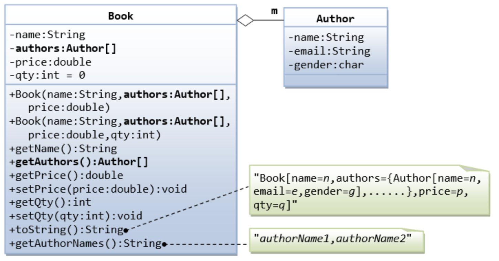
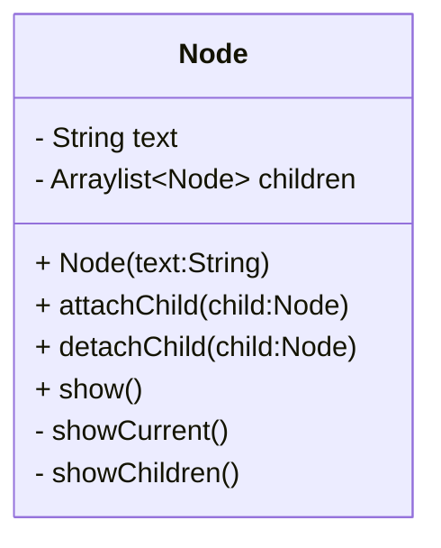

# Homework03

## Problem 1: The Author and Book Classes



A class called ***Author*** (as shown in the class diagram) is designed to model a book's author. It contains:
* Three private instance variables: name (String), email (String), and gender (char of either 'm' or 'f');
* One constructor to initialize the name, email and gender with the given values;
```
public Author (String name, String email, char gender) {......}
```
* public getters/setters: **getName()**, **getEmail()**, **setEmail()**, and **getGender()**. (Because the instance variables are private, you need the **getter** and **setter** to access them)

A class called ***Book*** is designed (as shown in the class diagram) to model a book. In reality, a book can be written by one or more author. So the Book class contains:
* Four private instance variables: name (String), authors (an Author array), price (double), and qty (int);
* Two constructors:
```
public Book (String name, Author[] authors, double price) { ...... } // The default value of qty is 0
public Book (String name, Author[] authors, double price, int qty) { ...... }
```
* public methods **getName()**, **getAuthors()**, **getPrice()**, **setPrice()**, **getQty()**, **setQty()**; (Because the instance variables are private, you need the **getter** and **setter** to access them)
* The **toString()** method shall return "Book[name=?,authors={Author[name=?,email=?,gender=?],......},price=?,qty=?]"; (You can write a toString() method for Author, and then reuse Author’s toString())
* The **getAuthorNames()** method shall return "authorName1,authorName2,......".

```java
class Author {
     /** WRITE YOUR CODE HERE **/
     Author(String name, String email, char gender){

     }
}

class Book {
     /** WRITE YOUR CODE HERE **/
     Book (String name, Author[] authors, double price) {

     }
     Book (String name, Author[] authors, double price, int qty) {

     }
     public String getAuthorNames() {
          return null; //Delete this line
     }
}
```

## Problem 2: Death management

Mr. Death oversees the fate of a select few individuals. Upon birth, each person's **name**, **health**, **strength**, **dexterity**, **intelligence**, **faith**, and **mana** are registered by Death. Every person can use `physicalAttack` and `magicAttack` to attack each other. In `physicalAttack`, if the attacker's **strength** is not less than the defender's **dexterity**, the defender's **health** decreases by the product of the attacker's **strength** and **dexterity**. In `magicAttack`, attacker will cost 20 **mana** to hurt the defender's **health** by the product of the attacker's **intelligence** and **faith**. `magicAttack` will do nothing if mana is not enough. If a person's **health** is zeroed out he dies, and can't attack anyone. Attacking the dead or let the dead attacking others will have no effect.

Please implement class `Person` and function `progressYear` and `deathRecord` in class `DeathManager`. We will use `newborn` to create new person. `progressYear` will let a year pass. `deathRecord` will return the record of the dead people and their age in order of the time they died. You are free to add code to the `DeathManager` class.
```java
class DeathManager {
    public class Person {
        public String name;
        public int health;
        public int strength;
        public int dexterity;
        public int intelligence;
        public int faith;
        public int mana;
        // if you need, you can add other members or methods
        public Person(String name, int health, int strength, int dexterity, int intelligence, int faith, int mana) {
            this.name = name;
            this.health = health;
            this.strength = strength;
            this.dexterity = dexterity;
            this.intelligence = intelligence;
            this.faith = faith;
            this.mana = mana;
            /** WRITE YOUR CODE HERE **/
        }
        public void physicalAttack(Person other){
            /** WRITE YOUR CODE HERE **/
        }
        public void magicAttack(Person other){
            /** WRITE YOUR CODE HERE **/
        }
    }
    
    public Person newborn(String name,int health, int strength, int dexterity, int intelligence, int faith, int mana){
        return new Person(name, health, strength, dexterity, intelligence, faith, mana); //Do not modify
    }
    public void progressYear() {
        /** WRITE YOUR CODE HERE **/
    }
    public List<Pair<String, Integer>> deathRecord() {
        /** WRITE YOUR CODE HERE **/
        return null; //Delete this line
    }
    /*
     * DeathManager s = new DeathManager();
     * DathManager.Person Covid = s.newborn("Covid",100,10,10,30,7,20);
     * DeathManager.Person David = s.newborn("David",150,10,5,3,6,210);
     * DeathManager.Person Emily = s.newborn("Emily",90,8,20,15,10,339);
     * s.progressYear();
     * Covid.magicAttack(David);
     * s.progressYear();
     * David.physicalAttack(Emily);
     * s.progressYear();
     * Covid.physicalAttack(Emily);
     * s.progressYear();
     * Emily.magicAttack(Covid);
     * s.deathRecord(); //[David=1, Covid=4]
     * */
}
```

## Problem 3: Items

Following problem 2, now Death will equip some people with items to give them buffs. Every item is defined as instance of a class inheriting class `item`. Some items may have active skills that can be used by calling `activeSkill`. Items can be granted to someone, and can also be removed. You have to implement function `grantItem` and `removeItem`. We have defined some items, and you have to add some code to realize their functions:

- Blade: Increases Dexterity by 5 points. Active skill: Deals 10+Strength damage to opponent for three times. Replace physical attack with active skill.
- Shield: When attacked, reduce damage by 20 points. Calculated with higher priority than CalamityRing.
- Wand: Active skill: cost 100 mana to deal 200 damage to opponent. Replace magic attack with active skill. Wand's active skill can be only used for 5 times, after that wand will be removed.
- RingOfSacrifice: When taken deadly damage, wearer will not die but reduce health to 1 point, but the ring itself breaks(be removed).
- CalamityRing: Wearer will take double damage.
- RingOfTheEvilEye: Absorb +30 health when the opponent dies.

```java
class DeathManager {
    public void grantItem(Person person, Item item) {
         /** WRITE YOUR CODE HERE **/
    }

    public void removeItem(Person person, Item item) {
         /** WRITE YOUR CODE HERE **/
    }

    private static class Item {
        void activeSkill(Person other) {
        }
    }

    public static class Blade extends Item {
        /** WRITE YOUR CODE HERE **/
    }

    public static class Shield extends Item {
        /** WRITE YOUR CODE HERE **/
    }

    public static class Wand extends Item {
         /** WRITE YOUR CODE HERE **/
    }

    public static class RingOfSacrifice extends Item {
         /** WRITE YOUR CODE HERE **/
    }

    public static class CalamityRing extends Item {
         /** WRITE YOUR CODE HERE **/
    }

    public static class RingOfTheEvilEye extends Item {
         /** WRITE YOUR CODE HERE **/
    }
    
    /*
     * DeathManager s = new DeathManager();
     * DeathManager.Person Covid = s.newborn("Covid",390,10,10,30,7,20);
     * DeathManager.Person David = s.newborn("David",150,10,5,10,7,220);
     * DeathManager.Wand wand = new DeathManager.Wand();
     * DeathManager.Shield shield = new DeathManager.Shield();
     * s.progressYear();
     * s.grantItem(David,wand);
     * s.grantItem(Covid,shield);
     * David.magicAttack(Covid);
     * s.progressYear();
     * wand.activeSkill(Covid);
     * s.progressYear();
     * wand.activeSkill(Covid);
     * s.progressYear();
     * s.removeItem(David,wand);
     * David.magicAttack(Covid);
     * s.deathRecord(); //[Covid=4]
     * */
}
```

## Problem 4: Your OJ

You're now a TA for SE I, and your students are now facing a task implementing a tree.

The task is to implement class `Node` following the UML diagram below:
*(again, you need mermaid plugin to see the graph below!)*


* **\+** -> public
* **\-** -> private

you need to use reflection mechanism in Java to test whether the implementation is right

you need to implement `checkClassInfo` method, you need to check all the members and methods in each class if they fit the specification.

The input `path` is a String showing the class path, you can directly use it to get a class.

return true if everything fit the specification.

(你需要判断成员变量、方法、构造函数是否符合UML图内的设定)

```java
public class Solution {
     public boolean checkClassInfo(String path) {
         try {
             /** WRITE YOUR CODE HERE **/
             Class<?> c = Class.forName(path);
         }
         catch (ClassNotFoundException ignored) {
             return false; // error handling, simply returns false
         }
         return false;
     }
}
```
> ##HINT:
> 1. you need to use `getName` first and check the members and function for each class according to the name.
> 2. for field, you need to check its modifiers, type and name;
> 3. for method, you need to check its modifiers, return type, param type and name;
> 4. you also need to check the class constructors
     > stfw if you get stuck :)