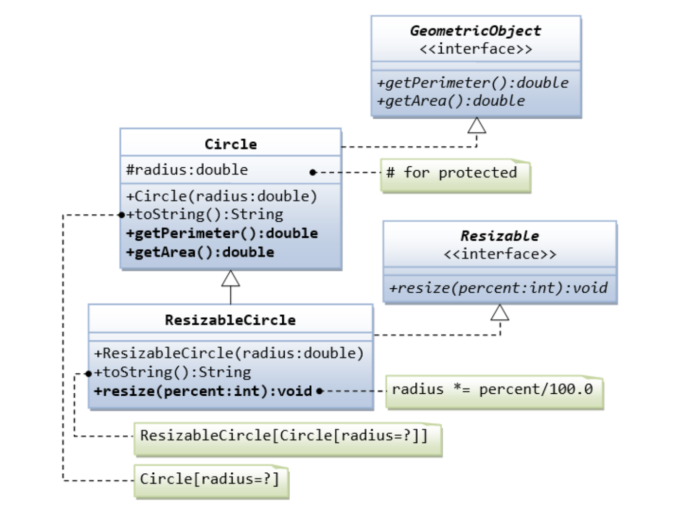

# Lab03

## Problem 1: Interfaces Resizable and GeometricObject

### **_pi = 3.14_**



Write the interface called GeometricObject, which declares two abstract methods: ***getParameter()*** and ***getArea()***, as specified in the class diagram.
```java
interface GeometricObject {
   public double getPerimeter();
   public double getArea();
}
```
Write the implementation class Circle, with a protected variable radius, which implements the interface GeometricObject.
```java
class Circle implements GeometricObject {
    // Protected variable
    /** WRITE YOUR CODE HERE **/

    // Constructor
    /** WRITE YOUR CODE HERE **/
    Circle(double radius){

    }
    
    // Implement toString method
    public String toString() {
        /**（保留一位小数）
         * output: Circle[radius=2.5] 
         * */
        /** WRITE YOUR CODE HERE **/
        return null; // Delete this line
    }
    
    // Implement methods defined in the interface GeometricObject
    @Override 
    public double getPerimeter() {
        /** WRITE YOUR CODE HERE **/
        return 0; // Delete this line
    }
    @Override
    public double getArea() {
        /** WRITE YOUR CODE HERE **/
        return 0; // Delete this line
    }

}
```
The class ResizableCircle is defined as a subclass of the class Circle, which also implements an interface called Resizable, as shown in class diagram. The interface Resizable declares an abstract method ***resize()***, which modifies the dimension (such as ***radius***) by the given percentage.
Write the interface Resizable and the class ResizableCircle.
```java
interface Resizable {
   public void resize(int percent);
}

class ResizableCircle extends Circle implements Resizable {
    // Constructor
    /** WRITE YOUR CODE HERE **/
    ResizableCircle(double radius){
       super(radius);
    }

    // Reimplement toString method
    public String toString() {
        /**（保留一位小数）
         * output: ResizableCircle[Circle[radius=2.5]] 
         * */
        /** WRITE YOUR CODE HERE **/
        return null; // Delete this line
    }
    
    // Implement methods defined in the interface Resizable
    @Override
    public void resize(int percent) {
        /** WRITE YOUR CODE HERE **/
    }
}
```

## Problem 2: MyDate
To implement a method of the MyDate class, the requirements are as follows:  
`isLeapYear():`Determine whether it is a leap year;

**四年一闰，百年不闰，四百年再闰**  

`isValidDate():`Determine whether it is a valid date;  
`setDate(MyDate date):`change the date;  
`toStringDate():`Returns the string format of the date, note that there are only two spaces, day is first and year is last. (e.g. ***"20 5 2024"***)
```java
class MyDate {
    int year;
    int month;
    int day;
    
    public MyDate(int day, int month, int year) {
        /* WRITE YOUR CODE HERE **/
    }

    public boolean isLeapYear(){
        /* WRITE YOUR CODE HERE **/
        return true; // Delete this line
    }
    public boolean isValidDate(){
        /* WRITE YOUR CODE HERE **/
        return true; // Delete this line
    }
    public void setDate(MyDate date){
        /* WRITE YOUR CODE HERE **/
    }
    public String toStringDate(){
        /* WRITE YOUR CODE HERE **/
        return null; // Delete this line
    }
}
```

## Problem 3: Trie Implementation

Trie is a classic data structure, combining the feature of dictionary and tree.

In this task, Trie has 3 APIs: `add`, `search`, `serialize`

For better understanding, we use an example to understand how Trie work.(in InTelliJ IDEA you might install plugin Mermaid to see following graph)

1. Trie is first initialized with sentinel node.
2. add a string `trie` to the Trie, the Trie changed:
    ```mermaid
    graph LR
    . --> t --> r --> i --> e
    ```
3. add another string `tree` to the Trie, the Trie changed:
   ```mermaid
   graph LR
   . --> t --> r --> i --> n1[e]
   r --> n2[e] --> e3[e]
   ```
4. search for string `tri`, we could find a path from `t` to `i`, hence return `true`
5. do `serialize`, we find all paths from root to leaves, hence return `["trie", "tree"]`

Your task is to implement the APIs of Trie:

1. `search`: if the given string is in the trie, return true, otherwise false.
   the given string excluded from the ones added to the trie may also return true.

   e.g. String `abcd` is  added to the trie, then searching for `abc` or `abcd` both return true since they're the prefix of the added word `abcd`
2. `add`: add the given string to the trie
3. `serialize`: serialize the trie into array. Just traverse the trie from root to the leaf, concatenate the characters along the path to form a string, and add every string into the array.

In this task, we ensure every string given are composed of lower case letters.
```java
 class Trie {
    // add members if you need! you can also define a inner class here
    public boolean search(String s) {
        /** WRITE YOUR CODE HERE **/
        return false; // Delete this line
    }
    
    public void add(String s) {
        /** WRITE YOUR CODE HERE **/
    }
        
    public List<String> serialize() {
        /** WRITE YOUR CODE HERE **/
        return null; // Delete this line
    }
}
```

## Problem 4: Handling Animals
Alice loves little animals! She raises a bunch of cats and dogs at her home!  
However, things are getting worse and worse these days.  
During the past 3 days, Alice found that at most 32,767 of her little animals has gone missing.  
That's too strange! All the animals are very peaceful. Where did the missing animals go?  
After another 2 days of observation, Alice finally noticed that some of the animals make unusual noise, which sounds like howl of a wolf.  
You are a professional animal handler. Alice need you to help her with taking care of her animals and find out the animals that shouldn't appear.

Alice gives you a list of `animals` that she wants you to take care of.  
Besides the `animals`, Alice tells you about `dogActivity`, `catActivity` and `wolfRecipe`.  
These three method name means that:
- __If an animal is a dog, you should execute `dogActivity` method of the animal.__
- __If an animal is a cat, you should execute `catActivity` method of the animal.__
- __If an animal is a wolf, you should kill the wolf and cook the animal by executing `wolfRecipe` method of the animal.__
- __Apparently the animal that needs to be killed does not execute the method, but dead wolves can be cooked.__
- __You can kill an animal by executing the `kill` method.__
- _______All the results of `dogActivity` and `catActivity` should be in the result list in the order of animals._______

Alice tells you how to identify the animals:
- __If an animal is a cat, by executing the `getCategory` method, you'll find that it returns `"Cat"`__

- __If an animal is a dog, by executing the `getCategory` method, you'll find that it returns `"Dog"`__

- __If an animal is a wolf, by executing the `getCategory` method, you'll find that it also returns `"Dog"`, because it's really hard to distinguish between dogs and wolves. But by executing the `shout` method, you'll find it ends with `"Howl!"`, which is not what the dogs shouts.__


Apart from all the works above, Alice need you to do something more:
- __Local residents believe that `666` represents the demon and brings bad luck. This is definitely not what Alice want. For the safety of herself, she wants you to replace all the `666` in the name of the animal to `888` with the `replace` method of `String` class if you find `666` in the name of some animal and kill the animal.__
- __The class member variable `name` stores the name of the animal.__
- __Attention that you cannot kill an animal twice, this is not allowed.__

Your task is to implement method `executeMethod` and `handleAnimals` (***you need to use reflection mechanism in Java***):
- __`executeMethod` needs you to execute a certain method called `methodName` and return the result, if the method returns nothing, you should return an empty string.__
- __`handleAnimals` needs you to implement the process above and return the result list mentioned above.__

```java
public class Solution {
    public String executeMethod(Object victim, String methodName) throws Exception {
        Object result = null;
        /* WRITE YOUR CODE HERE **/
        
        return (String) result;
    }

    public List<String> handleAnimals(Object[] animals, String dogActivity, String catActivity, String wolfRecipe) throws Exception {
        List<String> result = new ArrayList<>();
        /* WRITE YOUR CODE HERE **/
        
        return result;
    }
}
```