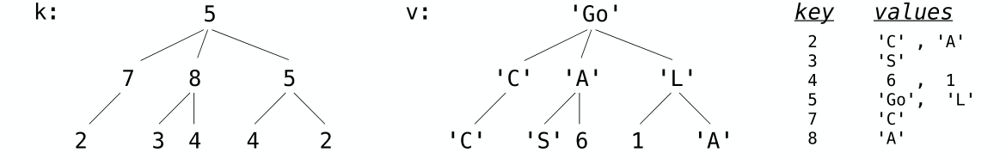

# Homework 5

[toc]

## Problem 1: Password Protected Account

In the lecture, we learned how to use functions to create mutable objects. Below is a function `make_withdraw` which produces a function that can withdraw money from an account:

```python
def make_withdraw(balance):
    """Return a withdraw function with BALANCE as its starting balance.
    >>> withdraw = make_withdraw(1000)
    >>> withdraw(100)
    900
    >>> withdraw(100)
    800
    >>> withdraw(900)
    'Insufficient funds'
    """
    def withdraw(amount):
        nonlocal balance
        if amount > balance:
           return 'Insufficient funds'
        balance = balance - amount
        return balance
    return withdraw
```

Write a version of the `make_withdraw` function that returns password-protected withdraw functions. That is, `make_withdraw` should take a password argument (a string) in addition to an initial  balance. The returned function should take two arguments: an amount to  withdraw and a password.

A password-protected `withdraw` function  should only process withdrawals that include a password that matches the original. Upon receiving an incorrect password, the function should:

1. Store that incorrect password in a list, and
2. Return the string 'Incorrect password'.

If a withdraw function has been called three times with incorrect passwords `<p1>`, `<p2>`, and `<p3>`, then it is locked. All subsequent calls to the function should return:

```python
"Your account is locked. Attempts: [<p1>, <p2>, <p3>]"
```

The incorrect passwords may be the same or different:

```python
def make_withdraw(balance, password):
    """Return a password-protected withdraw function.

    >>> w = make_withdraw(100, 'hax0r')
    >>> w(25, 'hax0r')
    75
    >>> error = w(90, 'hax0r')
    >>> error
    'Insufficient funds'
    >>> error = w(25, 'hwat')
    >>> error
    'Incorrect password'
    >>> new_bal = w(25, 'hax0r')
    >>> new_bal
    50
    >>> w(75, 'a')
    'Incorrect password'
    >>> w(10, 'hax0r')
    40
    >>> w(20, 'n00b')
    'Incorrect password'
    >>> w(10, 'hax0r')
    "Your account is locked. Attempts: ['hwat', 'a', 'n00b']"
    >>> w(10, 'l33t')
    "Your account is locked. Attempts: ['hwat', 'a', 'n00b']"
    >>> type(w(10, 'l33t')) == str
    True
    """
    "*** YOUR CODE HERE ***"
```

> You may find [Python string formatting syntax](https://docs.python.org/3/library/stdtypes.html#str.format) useful. A quick example:
>
> ```python
> >>> ten, twenty, thirty = 10, 'twenty', [30]
> >>> '{0} plus {1} is {2}'.format(ten, twenty, thirty)
> '10 plus twenty is [30]'
> ```

## Problem 2: Joint Account

Suppose that our banking system requires the ability to make joint accounts. Define a function `make_joint` that takes three arguments.

1. A password-protected `withdraw` function,
2. The password with which that `withdraw` function was defined, and
3. A new password that can also access the original account.

If the password is incorrect or cannot be verified because the underlying account is locked, the `make_joint` should propagate the error. Otherwise, it returns a `withdraw` function that provides additional access to the original account using *either* the new or old password. Both functions draw from the same balance.  Incorrect passwords provided to either function will be stored and cause the functions to be locked after three wrong attempts.

> *Hint1*: The solution is short (less than 10 lines) and contains no string literals! The key is to call withdraw with the right password and amount, then interpret the result. You may assume that all failed attempts to withdraw will return some string (for incorrect passwords, locked accounts, or insufficient funds), while successful withdrawals will return a number.
>
> *Hint2*: You can use `type(value) == str` to test if some value is a string.

```python
def make_joint(withdraw, old_pass, new_pass):
    """Return a password-protected withdraw function that has joint access to
    the balance of withdraw.

    >>> w = make_withdraw(100, 'hax0r')
    >>> w(25, 'hax0r')
    75
    >>> make_joint(w, 'my', 'secret')
    'Incorrect password'
    >>> j = make_joint(w, 'hax0r', 'secret')
    >>> w(25, 'secret')
    'Incorrect password'
    >>> j(25, 'secret')
    50
    >>> j(25, 'hax0r')
    25
    >>> j(100, 'secret')
    'Insufficient funds'

    >>> j2 = make_joint(j, 'secret', 'code')
    >>> j2(5, 'code')
    20
    >>> j2(5, 'secret')
    15
    >>> j2(5, 'hax0r')
    10

    >>> j2(25, 'password')
    'Incorrect password'
    >>> j2(5, 'secret')
    "Your account is locked. Attempts: ['my', 'secret', 'password']"
    >>> j(5, 'secret')
    "Your account is locked. Attempts: ['my', 'secret', 'password']"
    >>> w(5, 'hax0r')
    "Your account is locked. Attempts: ['my', 'secret', 'password']"
    >>> make_joint(w, 'hax0r', 'hello')
    "Your account is locked. Attempts: ['my', 'secret', 'password']"
    """
    "*** YOUR CODE HERE ***"
```

## Problem 3: Generate Permutations

Given a sequence of unique elements, a *permutation* of the sequence is a list containing the elements of the sequence in arbitrary order. For example, `[2, 1, 3]`, `[1, 3, 2]`, and `[3, 2, 1]` are some of the permutations of the sequence `[1, 2, 3]`. `[]` is the only permutations of `[]`.

Implement `permutations`, a generator function that takes in a sequence `seq` and returns a generator that yields all permutations of `seq`.

Permutations may be yielded in any order. Note that the doctests test whether you are yielding all possible permutations, but not the order. The built-in `sorted` function takes in an iterable object and returns a list containing the elements of the iterable in non-decreasing order.

> *Hint1*: If you had the permutations of all the elements in `seq` not including the first element, how could you use that to generate the permutations of the full seq?
>
> *Hint2*: There is no need to use some advanced non-recursive algorithms, which you may find on the Internet. Combination of `yield` and recursion is sufficient.

```python
def permutations(seq):
    """Generates all permutations of the given sequence. Each permutation is a
    list of all elements in seq. The permutations could be yielded in any order.

    >>> perms = permutations([100])
    >>> type(perms)
    <class 'generator'>
    >>> next(perms)
    [100]
    >>> try: #this piece of code prints "No more permutations!" if calling next would cause an error
    ...     next(perms)
    ... except StopIteration:
    ...     print('No more permutations!')
    No more permutations!
    >>> sorted(permutations([1, 2, 3])) # Returns a sorted list containing elements of the generator
    [[1, 2, 3], [1, 3, 2], [2, 1, 3], [2, 3, 1], [3, 1, 2], [3, 2, 1]]
    >>> sorted(permutations((10, 20, 30)))
    [[10, 20, 30], [10, 30, 20], [20, 10, 30], [20, 30, 10], [30, 10, 20], [30, 20, 10]]
    >>> sorted(permutations("ab"))
    [['a', 'b'], ['b', 'a']]
    """
    "*** YOUR CODE HERE ***"
```

## Problem 4: Trictionary or Treat



A trictionary is a pair of tree `k` and `v`. They have identical structure: each node in `k` has a corresponding node in `v`. The labels in `k` are called keys. Each key may be the label for multiple nodes in `k`, and the values for that key are the labels of all the corresponding nodes in `v`.

A lookup function returns one of the values for a key. Specifically, a lookup function for a node in `k` is a function that takes `v` as an argument and returns the label for the corresponding node in `v`.

Implement the generator function `lookups`, which takes as input a tree `k` and a key. It yields all lookup functions for nodes in `k` that have key as their label, the functions could be yielded in any order.

```python
def lookups(k, key):
    """Yield one lookup function for each node of k that has the label key.
    >>> k = tree(5, [tree(7, [tree(2)]), tree(8, [tree(3), tree(4)]), tree(5, [tree(4), tree(2)])])
    >>> v = tree('Go', [tree('C', [tree('C')]), tree('A', [tree('S'), tree(6)]), tree('L', [tree(1), tree('A')])])
    >>> type(lookups(k, 4))
    <class 'generator'>
    >>> sorted([f(v) for f in lookups(k, 2)])
    ['A', 'C']
    >>> sorted([f(v) for f in lookups(k, 3)])
    ['S']
    >>> [f(v) for f in lookups(k, 6)]
    []
    """
    "*** YOUR CODE HERE ***"
```

## Problem 5: Remainder Generator

Like functions, generators can also be higher-order. For this problem, we will be writing `remainders_generator`, which yields a series of generator objects.

`remainders_generator` takes in an integer `m`, and yields `m` different generators. The first generator is a generator of multiples of `m`, i.e. numbers where the remainder is 0. The second is a generator of natural numbers with remainder 1 when divided by `m`. The last generator yields natural numbers with remainder `m - 1` when divided by `m`. Note that different generators should not influence each other.

> Hint: Consider defining an inner generator function. Each yielded  generator varies only in that the elements of each generator have a  particular remainder when divided by m. What does that tell you about  the argument(s) that the inner function should take in?

```python
def remainders_generator(m):
    """
    Yields m generators. The ith yielded generator yields natural numbers whose
    remainder is i when divided by m.

    >>> import types
    >>> [isinstance(gen, types.GeneratorType) for gen in remainders_generator(5)]
    [True, True, True, True, True]
    >>> remainders_four = remainders_generator(4)
    >>> for i in range(4):
    ...     print("First 3 natural numbers with remainder {0} when divided by 4:".format(i))
    ...     gen = next(remainders_four)
    ...     for _ in range(3):
    ...         print(next(gen))
    First 3 natural numbers with remainder 0 when divided by 4:
    4
    8
    12
    First 3 natural numbers with remainder 1 when divided by 4:
    1
    5
    9
    First 3 natural numbers with remainder 2 when divided by 4:
    2
    6
    10
    First 3 natural numbers with remainder 3 when divided by 4:
    3
    7
    11
    """
    "*** YOUR CODE HERE ***"
```

Note that if you have implemented this correctly, each of the generators yielded by `remainder_generator` will be infinite - you can keep calling next on them forever without running into a `StopIteration` exception.