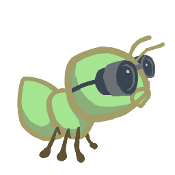
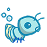

# Project 3

**Acknowledgments**: All materials is from [cs61a](https://cs61a.org/). Tom Magrino and Eric Tzeng developed this project with John DeNero. Jessica Wan contributed the original artwork. Joy Jeng and Mark Miyashita invented the queen ant. Many others have contributed to the project as well!

The new concept artwork was drawn by Alana Tran, Andrew Huang, Emilee Chen, Jessie Salas, Jingyi Li, Katherine Xu, Meena Vempaty, Michelle Chang, and Ryan Davis.

[toc]

## Project Structure

Below is a list of all the files you will see in this project. You only have to make changes to `ants.py` to finish the project.

```
src
  |-ants.py     # The game logic of Ants Vs. SomeBees
  |-gui.py      # Web-based GUI for Ants Vs. SomeBees
  |-ants_gui.py # The original GUI for Ants Vs. SomeBees
  |-graphics.py # Utilities for displaying simple two-dimensional animations
  |-utils.py    # Some functions to facilitate the game interface
  |-ucb.py      # Utility functions from CS 61A
  |-assets      # A directory of images and files used by gui.py
  |-img         # A directory of images used by ants_gui.py
```

As you may see, we have two version of GUIs in the project. One is in `gui.py`, the other is in `ants_gui.py`. Feel free to choose any one you like.

------

**Suggestion:**

For the functions that we ask you to complete, there may be some initial code that we provide. If you would rather not use that code, feel free to delete it and start from scratch. You may also add new function definitions as you see fit.

However, please do **not** modify any other functions. Doing so may result in your code failing our framework. Also, please do **not** change any function signatures (names, argument order, or number of arguments).

## The Game

A game of Ants Vs. SomeBees consists of a series of turns. In each turn, new bees may enter the ant colony. Then, new ants are placed to defend their colony. Finally, all insects (ants, then bees) take individual actions. Bees either try to move toward the end of the tunnel or sting ants in their way. Ants perform a different action depending on their type, such as collecting more food or throwing leaves at the bees. The game ends either when a bee reaches the end of the tunnel (you lose), the bees destroy the `QueenAnt` if it exists (you lose), or the entire bee fleet has been vanquished (you win).


### Core Concepts

**The Colony.** This is where the game takes place. The colony consists of several Places that are chained together to form a tunnel where bees can travel through. The colony also has some quantity of food which can be expended in order to place an ant in a tunnel.

**Places.** A place links to another place to form a tunnel. The player can put a single ant into each place. However, there can be many bees in a single place.

**The Hive.** This is the place where bees originate. Bees exit the beehive to enter the ant colony.

**Ants.** Players place an ant into the colony by selecting from the available ant types at the top of the screen. Each type of ant takes a different action and requires a different amount of colony food to place. The two most basic ant types are the `HarvesterAnt`, which adds one food to the colony during each turn, and the `ThrowerAnt`, which throws a leaf at a bee each turn. You will be implementing many more!

**Bees.** In this game, bees are the antagonistic forces that the player must defend the ant colony from. Each turn, a bee either advances to the next place in the tunnel if no ant is in its way, or it stings the ant in its way. Bees win when at least one bee reaches the end of a tunnel.

### Core Classes

The concepts described above each have a corresponding class that encapsulates the logic for that concept. Here is a summary of the main classes involved in this game:

**GameState:** Represents the colony and some state information about the game, including how much food is available, how much time has elapsed, where the `AntHomeBase` is, and all the Places in the game.

**Place:** Represents a single place that holds insects. At most one Ant can be in a single place, but there can be many Bees in a single place. Place objects have an exit to the left and an entrance to the right, which are also places. Bees travel through a tunnel by moving to a Place's exit.

**Hive:** Represents the place where Bees start out (on the right of the tunnel).

**AntHomeBase:** Represents the place Ants are defending (on the left of the tunnel). If Bees get here, they win :(

**Insect:** A superclass for Ant and Bee. All insects have health attribute, representing their remaining health, and a place attribute, representing the Place where they are currently located. Each turn, every active Insect in the game performs its action.

**Ant:** Represents ants. Each Ant subclass has special attributes or a special action that distinguish it from other Ant types. For example, a `HarvesterAnt` gets food for the colony and a `ThrowerAnt` attacks Bees. Each ant type also has a `food_cost` attribute that indicates how much it costs to deploy one unit of that type of ant.

**Bee:** Represents bees. Each turn, a bee either moves to the exit of its current Place if the Place is not blocked by an ant, or stings the ant occupying its same Place.

------

> CS61A提供了一份[类图（引用自冯新宇和李樾老师的NJU-SICP课程）](https://nju-sicp.bitbucket.io/2021/projs/proj03/resources/ants_diagram.pdf)，可以用于理解不同的类是如何组合到一起的；

> *Tips about VSCode*: For VSCode user, we can use **OUTLINE** in the explorer to view the source code structure conveniently. 
>
> Try many useful actions pointed to by the red arrow if we would like to maximize our coding power.

### Game Layout

Below is a visualization of a GameState. ***As you work through the problems, we recommend drawing out similar diagrams to help your understanding.***


### Playing the Game

The game can be run in two modes: as a text-based game or using a graphical user interface (GUI). The game logic is the same in either case, but the GUI enforces a turn time limit that makes playing the game more exciting. The text-based interface is provided for debugging and development.

The files are separated according to these two modes. `ants.py` knows nothing of graphics or turn time limits.

To start a text-based game, run

```
python ants_text.py
```

To start a graphical game, run

```
python gui.py
```

or

```
python ants_gui.py
```

When you start the graphical version, a new window should appear. In the starter implementation, you have unlimited food and your ants can only throw leaves at bees in their current Place.

Before you complete Problem 2, the GUI may crash since it doesn't have a full conception of what a Place is yet! Try playing the game anyway! You'll need to place a lot of `ThrowerAnts` (the second type) in order to keep the bees from reaching your queen.

The game has several options that you will use throughout the project, which you can view with `python3 ants_text.py --help`.

```
usage: ants_text.py [-h] [-d DIFFICULTY] [-w] [--food FOOD]

Play Ants vs. SomeBees

optional arguments:
  -h, --help     show this help message and exit
  -d DIFFICULTY  sets difficulty of game (test/easy/normal/hard/extra-hard)
  -w, --water    loads a full layout with water
  --food FOOD    number of food to start with when testing
```

## Phase 1: Basic Gameplay

In the first phase you will complete the implementation that will allow for basic gameplay with the two basic Ants: the `HarvesterAnt` and the `ThrowerAnt`.

### About the Game

Answer the following questions after you have read the entire `ants.py` file, to guarantee you have the right understanding about the game.

If you get stuck while answering these questions, you can try reading through `ants.py` again, consult the *core concepts* or *core classes* sections above.

1. What is the significance of an Insect's `health` attribute? Does this value change? If so, how?
2. Which of the following is a class attribute of the `Insect` class?
3. Is the `health` attribute of the `Ant` class an instance attribute or a class attribute? Why?
4. Is the `damage` attribute of an `Ant` subclass (such as `ThrowerAnt`) an instance attribute or class attribute? Why?
5. Which class do both `Ant` and `Bee` inherit from?
6. What do instances of Ant and instances of Bee have in common?
7. How many insects can be in a single `Place` at any given time (before Problem 8)?
8. What does a `Bee` do during one of its turns?
9. When is the game lost?

### Problem 1: Ants Need Food

> 在写代码之前，先尝试回答以下问题来验证下你对题目的理解：
>
> 1. Q: What is the purpose of the `food_cost` attribute?
>    Choose the number of the correct choice:
>    0) Each turn, each Ant in the colony eats `food_cost` food from the
>        colony's total available food
>    1) Each turn, each Ant in the colony adds `food_cost` food to the
>       colony's total available food
>    2) Placing an ant into the colony will decrease the colony's total
>       available food by that ant's `food_cost`
> 2. Q: What type of attribute is `food_cost`?
>    Choose the number of the correct choice:
>    0) instance, the `food_cost` of an Ant depends on the location it is placed
>    1) instance, the `food_cost` of an Ant is randomized upon initialization
>    2) class, all Ants cost the same to place no matter what type of Ant it is
>    3) class, all Ants of the same subclass cost the same to place
>
> 答案：
>
> 1. 2/c 
>
> 2. 3/d

**Part A:** Currently, there is no cost for placing any type of `Ant`, and so there is no challenge to the game. The base class `Ant` has a `food_cost` of zero. Override this class attribute for `HarvesterAnt` and `ThrowerAnt` according to the "Food Cost" column in the table below.

|                               | Class          | Food Cost | Health |
| ----------------------------- | -------------- | --------- | ------ |
|  | `HarvesterAnt` | 2         | 1      |
|    | `ThrowerAnt`   | 3         | 1      |

**Part B**: Now that deploying cost food of `Ant`, we need to be able to gather more food! To fix this issue, implement the `HarvesterAnt` class. A `HarvesterAnt` is a subclass of `Ant` that adds one food to the `gamestate.food` total in its `action`.

Try playing the game by running `python3 gui.py`. Once you have placed a `HarvesterAnt`, you should accumulate food each turn. You can also place `ThrowerAnt`s, but you'll see that they can only attack bees that are in their `Place`, making it a little difficult to win.

### Problem 2: Build Tunnel

> 在写代码之前，先尝试回答以下问题来验证下你对题目的理解：
>
> 1. Q: What does a Place represent in the game?
>    Choose the number of the correct choice:
>    0) Where the bees start out in the game
>    1) The entire space where the game takes place
>    2) A single tile that an Ant can be placed on and that connects to
>       other Places
>    3) The tunnel that bees travel through
> 2. Q: p is a Place whose entrance is q and exit is r (q and r are not None). When is p.entrance first set to a non-None value?
>    Choose the number of the correct choice:
>    0) Never, it is always set to None
>    1) When q is constructed
>    2) When p is constructed
> 3. Q: p is a Place whose entrance is q and exit is r (q and r are not None). When is p.exit first set to a non-None value?
>    Choose the number of the correct choice:
>    0) When q is constructed
>    1) Never, it is always set to None
>    2) When p is constructed
>
> 答案：
>
> 1. 2/c
> 2. 1/b
> 3. 2/c

Complete the `Place` constructor by adding code that tracks entrances. Right now, a `Place` keeps track only of its `exit`. We would like a `Place` to keep track of its entrance as well. A `Place` needs to track only one `entrance`. Tracking entrances will be useful when an `Ant` needs to see what `Bee`s are in front of it in the tunnel.

However, simply passing an entrance to a `Place` constructor will be problematic; we would need to have both the exit and the entrance before creating a `Place`! (It's a chicken or the egg problem.) To get around this problem, we will keep track of entrances in the following way instead. The `Place` constructor should specify that:

- A newly created `Place` always starts with its `entrance` as `None`.
- If the `Place` has an `exit`, then the `exit`'s `entrance` is set to that `Place`.

> *Hint1*: Remember that when the `__init__` method is called, the first parameter, `self`, is bound to the newly created object.
>
> *Hint2*: Try drawing out two `Place`s next to each other if things get confusing. In the GUI, a place's `entrance` is to its right while the `exit` is to its left.
>
> *Hint3*: Remember that Places are not stored in a list, so you can't index into anything to access them. This means that you **can't** do something like `colony[index + 1]` to access an adjacent Place. How can you move from one place to another?


### Problem 3: Thrower Throws

> 在写代码之前，先尝试回答以下问题来验证下你对题目的理解：
>
> 1. Q: What Bee should a ThrowerAnt throw at?
>    Choose the number of the correct choice:
>    0) The ThrowerAnt throws at a random Bee in its own Place
>    1) The ThrowerAnt finds the nearest place behind its own place
>       that has Bees and throws at a random Bee in that place
>    2) The ThrowerAnt finds the nearest place including and in front of its
>       own place that has Bees and throws at a random Bee in that place
>    3) The ThrowerAnt finds the nearest place in either direction that has
>       Bees and throws at a random Bee in that place
> 2. Q: How do you get the Place object in front of another Place object?
>    Choose the number of the correct choice:
>    0) Decrement the place by 1
>    1) The place's exit instance attribute
>    2) The place's entrance instance attribute
>    3) Increment the place by 1
> 3. Q: What is the entrance of the first Place in a tunnel (i.e. where do the bees enter from)?
>    Choose the number of the correct choice:
>    0) An empty Place
>    1) None
>    2) The Hive
> 4. Q: How can you determine if a given Place is the Hive?
>    Choose the number of the correct choice:
>    0) by checking the `bees` attribute of the place instance
>    1) by checking the `ant` attribute of the place instance
>    2) by using the `is_hive` attribute of the place instance
> 5. Q: What should `nearest_bee` return if there is no Bee in front of the ThrowerAnt in the tunnel?
>    Choose the number of the correct choice:
>    0) The closest Bee behind the ThrowerAnt
>    1) None
>    2) A random Bee in the Hive
>
> 答案：
>
> 1. 2/c 
> 2. 2/c
> 3. 2/c
> 4. 2/c
> 5. 1/b

In order for a ThrowerAnt to attack, it must know which bee it should hit. The provided implementation of the `nearest_bee` method in the ThrowerAnt class only allows them to hit bees in the same Place. Your job is to fix it so that a ThrowerAnt will `throw_at` the nearest bee in front of it that is not still in the Hive. Go back to *Core Concepts* to review the definition of Hive.

> *Hint*: All Places have an `is_hive` attribute which is `True` when that place is the `Hive`.

The `nearest_bee` method returns a random `Bee` from the nearest place that contains bees. Places are inspected in order by following their `entrance` attributes.

- Start from the current `Place` of the `ThrowerAnt`.
- For each place, return a random bee if there is any, or consider the next place that is stored as the current place's `entrance`.
- If there is no bee to attack, return `None`.

> *Hint1*: The `random_bee` function provided in `ants.py` returns a random bee from a list of bees or None if the list is empty.
>
> *Hint2*: As a reminder, if there are no bees present at a Place, then the bees attribute of that Place instance will be an empty list.
>
> Hint3: Having trouble visualizing the test cases? Try drawing them out on paper! The example diagram provided in Game Layout shows the first test case for this problem.

After implementing `nearest_bee`, a `ThrowerAnt` should be able to `throw_at` a `Bee` in front of it that is not still in the `Hive`. Make sure that your ants do the right thing! To start a game with ten food (for easy testing):

```
python gui.py --food 10
# or
python ants_gui.py --food 10
```

Now you have finished ***Phase One*** !

## Phase 2: Ants!

Now that you've implemented basic gameplay with two types of `Ant`s, let's add some flavor to the ways ants can attack bees. In this phase, you'll be implementing several different `Ant`s with different offensive capabilities.

After you implement each `Ant` subclass in this section, you'll need to set its `implemented` attribute to `True` so that that type of ant will show up in the GUI. Feel free to try out the game with each new ant to test the functionality!

With your Phase 2 ants, try `python ants_gui.py -d easy` to play against a full swarm of bees in a multi-tunnel layout and try `-d normal`, `-d hard`, or `-d extra-hard` if you want a real challenge! If the bees are too numerous to vanquish, you might need to create some new ants.

### Problem 4: Short and Long Thrower

> 在写代码之前，先尝试回答以下问题来验证下你对题目的理解：
>
> 1. Q: What class do ShortThrower and LongThrower inherit from?
>    Choose the number of the correct choice:
>    0) Bee
>    1) ShortThrower
>    2) ThrowerAnt
>    3) LongThrower
> 2. Q: What constraint does a regular ThrowerAnt have on its throwing distance?
>    Choose the number of the correct choice:
>    0) There is no restriction on how far a regular ThrowerAnt can throw
>    1) A regular ThrowerAnt can only attack Bees at most 3 places away
>    2) A regular ThrowerAnt can only attack Bees at most 5 places away
>    3) A regular ThrowerAnt can only attack Bees at least 3 places away
> 3. Q: What constraint does a LongThrower have on its throwing distance?
>    Choose the number of the correct choice:
>    0) A LongThrower can only attack Bees at most 5 places away
>    1) There is no restriction on how far a LongThrower can throw
>    2) A LongThrower can only attack Bees at least 5 places away
>    3) A LongThrower can only attack Bees at least 3 places away
> 4. Q: What constraint does a ShortThrower have on its throwing distance?
>    Choose the number of the correct choice:
>    0) A ShortThrower can only attack Bees at most 5 places away
>    1) A ShortThrower can only attack Bees at least 3 places away
>    2) There is no restriction on how far a ShortThrower can throw
>    3) A ShortThrower can only attack Bees at most 3 places away
> 5. Q: With the addition of these new ThrowerAnt subclasses, we must modify
>    our definition of `nearest_bee`. Now what Bee should ThrowerAnts throw
>    at?
>    Choose the number of the correct choice:
>    0) The closest Bee behind it within range
>    1) Any Bee within range
>    2) The closest Bee in front of it within range
>    3) Any Bee in its current Place
>
> 答案：
>
> 1. 2/c
> 2. 0/a
> 3. 2/c
> 4. 3/d
> 5. 2/c

The `ThrowerAnt` is a great offensive unit, but it'd be nice to have a cheaper unit that can throw. Implement two subclasses of `ThrowerAnt` that are less costly but have constraints on the distance they can throw:

- The `LongThrower` can only `throw_at` a `Bee` that is found after following at least 5 `entrance` transitions. It cannot hit `Bee`s that are in the same `Place` as it or the first 4 `Place`s in front of it. If there are two `Bee`s, one too close to the `LongThrower` and the other within its range, the `LongThrower` should throw past the closer `Bee` and target the farther one, which is within its range.
- The `ShortThrower` can only `throw_at` a `Bee` that is found after following at most 3 `entrance` transitions. It cannot throw at any bees further than 3 `Place`s in front of it.

Neither of these specialized throwers can `throw_at` a `Bee` that is exactly 4 `Place`s away.

|                                  | Class          | Food Cost | Health |
| -------------------------------- | -------------- | --------- | ------ |
|   | `ShortThrower` | 2         | 1      |
|  | `LongThrower`  | 2         | 1      |

A good way to approach the implementation to `ShortThrower` and `LongThrower` is to have it inherit the `nearest_bee` method from the base `ThrowerAnt` class. The logic of choosing which bee a thrower ant will attack is essentially the same, except the `ShortThrower` and `LongThrower` ants have maximum and minimum ranges, respectively.

To implement these behaviors, you will need to modify the `nearest_bee` method to reference `min_range` and `max_range` attributes, and only return a bee that is in range.

Make sure to give these `min_range` and `max_range` sensible defaults in `ThrowerAnt` that do not change its behavior. Then, implement the subclasses `LongThrower` and `ShortThrower` with appropriately constrained ranges and correct food costs.

> *Hint*: `float('inf')` returns an infinite positive value represented as a float that can be compared with other numbers.

Don't forget to set the `implemented` class attribute of `LongThrower` and `ShortThrower` to `True`.

> *Note:* Please make sure your attributes are called `max_range` and `min_range` rather than `maximum_range` and `minimum_range` or something. The tests directly reference the variable via this name.

### Problem 5: Fire Ant

> 在写代码之前，先尝试回答以下问题来验证下你对题目的理解：
>
> 1. Q: How can you obtain the current place of a FireAnt?
>    Choose the number of the correct choice:
>    0) By calling the FireAnt constructor
>    1) By accessing the place instance attribute, which is the name of some Place object
>    2) By accessing the place instance attribute, which is a Place object
>    3) By calling the Place constructor, passing in the FireAnt instance
> 2. Q: How can you obtain all of the Bees currently in a given place?
>    Choose the number of the correct choice:
>    0) By calling the Bee constructor, passing in the place instance
>    1) By accessing the bees instance attribute, which is a dictionary of Bee objects
>    2) By calling the add_insect method on the place instance
>    3) By accessing the bees instance attribute, which is a list of Bee objects
> 3. Q: Can you iterate over a list while mutating it?
>    Choose the number of the correct choice:
>    0) Yes, you can mutate a list while iterating over it with no problems
>    1) Yes, but you should iterate over a copy of the list to avoid skipping elements
>    2) No, Python doesn't allow list mutation on a list that is being iterated through
>
> 答案：
>
> 1. 2/c
> 2. 3/d
> 3. 1/b

Implement the `FireAnt`, which does damage when it receives damage. Specifically, if it is damaged by `health` health units, it does a damage of `health` to all bees in its place (this is called *reflected damage*).

If it dies, it does an additional amount of damage, which is specified by its `damage` attribute (by default 3).

To implement this, we have to override the `FireAnt`'s `reduce_health` method. Normally, `Insect.reduce_health` will decrement the insect's `health` by the given `amount` and remove the insect from its place if `health` reaches zero or lower. However, `FireAnt` also does damage to all the bees in its place when it receives damage, with a special bonus when its health drops to 0, before being removed from its `place`.

|                          | Class     | Food Cost | Health |
| ------------------------ | --------- | --------- | ------ |
|  | `FireAnt` | 5         | 3      |

> *Hint1*: To damage a `Bee`, call the `reduce_health` method inherited from `Insect`.
>
> *Hint2*: Damaging a bee may cause it to be removed from its place. If you iterate over a list, but change the contents of that list at the same time, you [may not visit all the elements](https://docs.python.org/3/tutorial/controlflow.html#for-statements). This can be prevented by making a copy of the list. You can either use a list slice, or use the built-in `list` function.
>
> ```python
> >>> lst = [1,2,3,4]
> >>> lst[:]
> [1, 2, 3, 4]
> >>> list(lst)
> [1, 2, 3, 4]
> >>> lst[:] is not lst and list(lst) is not lst
> True
> ```

Once you've finished implementing the `FireAnt`, give it a class attribute `implemented` with the value `True`.

> *Note*: even though you are overriding the `Insect.reduce_health` function, you can still use it in your implementation by calling it directly (rather than via `self`). Note that this is not recursion (why?)

## Phase 3: More Ants

### Problem 6: Wall Ant

> 在写代码之前，先尝试回答以下问题来验证下你对题目的理解：
>
> 1. Q: What class does WallAnt inherit from?
>    Choose the number of the correct choice:
>    0) The WallAnt class does not inherit from any class
>    1) ThrowerAnt
>    2) Ant
>    3) HungryAnt
> 2. Q: What is a WallAnt's action?
>    Choose the number of the correct choice:
>    0) A WallAnt attacks all the Bees in its place each turn
>    1) A WallAnt increases its own health by 1 each turn
>    2) A WallAnt reduces its own health by 1 each turn
>    3) A WallAnt takes no action each turn
> 3. Q: Where do Ant subclasses inherit the action method from?
>    Choose the number of the correct choice:
>    0) Ant subclasses inherit the action method from the Ant class
>    1) Ant subclasses inherit the action method from the Insect class
>    2) Ant subclasses do not inherit the action method from any class
> 4. Q: If a subclass of Ant does not override the action method, what is the
>    default action?
>    Choose the number of the correct choice:
>    0) Move to the next place
>    1) Nothing
>    2) Reduce the health of all Bees in its place
>    3) Throw a leaf at the nearest Bee
> 5. Q: What type of attribute is health?
>    Choose the number of the correct choice:
>    0) class, all Ants have the same health no matter what type of Ant it is
>    1) instance, all Ants have different default starting healths
>    2) class, all Ants of the same subclass have the same health
>    3) instance, all Ants keep track of their own health
>
> 答案：
>
> 1. 2/c
> 2. 3/d
> 3. 1/b
> 4. 1/b
> 5. 3/d

We are going to add some protection to our glorious home base by implementing the `WallAnt`, which is an ant that does nothing each turn. A `WallAnt` is useful because it has a large `health` value.

|                          | Class     | Food Cost | Health |
| ------------------------ | --------- | --------- | ------ |
|  | `WallAnt` | 4         | 4      |

Unlike with previous ants, we have not provided you with a class header. Implement the `WallAnt` class from scratch. Give it a class attribute `name` with the value `'Wall'` (so that the graphics work) and a class attribute `implemented` with the value `True` (so that you can use it in a game).

### Problem 7: Hungry Ant

> 在写代码之前，先尝试回答以下问题来验证下你对题目的理解：
>
> 1. Q: Should chew_countdown be an instance or class attribute? Why?
>    Choose the number of the correct choice:
>    0) class, all HungryAnt instances in the game chew simultaneously
>    1) instance, all HungryAnt instances in the game chew simultaneously
>    2) instance, each HungryAnt instance chews independently of other
>       HungryAnt instances
>    3) class, each HungryAnt instance chews independently of other
>       HungryAnt instances
> 2. Q: When is a HungryAnt able to eat a Bee?
>    Choose the number of the correct choice:
>    0) Whenever a Bee is in its place
>    1) When it is chewing, i.e. when its chew_countdown attribute is at least 1
>    2) Each turn
>    3) When it is not chewing, i.e. when its chew_countdown attribute is 0
> 3. Q: When a HungryAnt is able to eat, which Bee does it eat?
>    Choose the number of the correct choice:
>    0) The closest Bee behind it
>    1) The closest Bee in either direction
>    2) A random Bee in the same place as itself
>    3) The closest Bee in front of it
>
> 答案：
>
> 1. 2/c
> 2. 3/d
> 3. 2/c

Implement the `HungryAnt`, which will select a random `Bee` from its `place` and eat it whole. After eating a `Bee`, it must spend 3 turns chewing before eating again. If there is no bee available to eat, it will do nothing.

|                            | Class       | Food Cost | Health |
| -------------------------- | ----------- | --------- | ------ |
|  | `HungryAnt` | 4         | 1      |

Give `HungryAnt` a `chew_duration` class attribute that holds the number of turns that it takes a `HungryAnt` to chew (default to 3). Also, give each `HungryAnt` an instance attribute `chew_countdown` that counts the number of turns it has left to chew (default is 0, since it hasn't eaten anything at the beginning).

Implement the `action` method of the `HungryAnt` to check if it is chewing; if so, decrement its `chew_countdown` counter. Otherwise, eat a random `Bee` in its `place` by reducing the `Bee`'s health to 0 and restart the `chew_countdown` timer.

### Problem 8: Bodyguard Ant

> 在写代码之前，先尝试回答以下问题来验证下你对题目的理解：
>
> 1. Q: Which Ant does a BodyguardAnt guard?
>    Choose the number of the correct choice:
>    0) All the Ant instances in the gamestate
>    1) The Ant instance in the place closest to its own place
>    2) The Ant instance that is in the same place as itself
>    3) A random Ant instance in the gamestate
> 2. Q: How does a BodyguardAnt guard its ant?
>    Choose the number of the correct choice:
>    0) By allowing Bees to pass without attacking
>    1) By attacking Bees that try to attack it
>    2) By increasing the ant's health
>    3) By protecting the ant from Bees and allowing it to perform its original action
> 3. Q: Where is the ant contained by a BodyguardAnt stored?
>    Choose the number of the correct choice:
>    0) In its place's ant instance attribute
>    1) Nowhere, a BodyguardAnt has no knowledge of the ant that it's protecting
>    2) In the BodyguardAnt's ant_contained instance attribute
>    3) In the BodyguardAnt's ant_contained class attribute
> 4. Q: When can a second Ant be added to a place that already contains an Ant?
>    Choose the number of the correct choice:
>    0) When both Ant instances are containers
>    1) When exactly one of the Ant instances is a container and the
>       container ant does not already contain another ant
>    2) There can never be two Ant instances in the same place
>    3) When exactly one of the Ant instances is a container
> 5. Q: If two Ants occupy the same Place, what is stored in that place's ant
>    instance attribute?
>    Choose the number of the correct choice:
>    0) The Ant being contained
>    1) Whichever Ant was placed there first
>    2) The Container Ant
>    3) A list containing both Ants
>
> 答案：
>
> 1. 2/c
> 2. 3/d
> 3. 2/c
> 4. 1/b
> 5. 2/c

Right now, our ants are quite frail. We'd like to provide a way to  help them last longer against the onslaught of the bees. Enter the `BodyguardAnt`.

|                               | Class          | Food Cost | Health |
| ----------------------------- | -------------- | --------- | ------ |
|  | `BodyguardAnt` | 4         | 2      |

A `BodyguardAnt` differs from a normal ant because it is a `ContainerAnt`; it can contain another ant and protect it, all in one `Place`. When a `Bee` stings the ant in a `Place` where one ant contains another, only the container is damaged. The ant  inside the container can still perform its original action. If the  container perishes, the contained ant still remains in the place (and  can then be damaged).

Each `ContainerAnt` has an instance attribute `ant_contained` that stores the ant it contains. It initially starts off as `None`, to indicate that no ant is being protected. Implement the `store_ant` method so that it sets the bodyguard's `ant_contained` instance attribute to the passed in `ant` argument. Also implement the `ContainerAnt`'s `action` method to perform its `ant_contained`'s action if it is currently containing an ant.

In addition, you will need to make the following modifications  throughout your program so that a container and its contained ant can  both occupy a place at the same time (a maximum of two ants per place),  but only if exactly one is a container:

1. There is an `Ant.can_contain` method, but it always returns `False`. Override the method `ContainerAnt.can_contain` so that it takes an ant other as an argument and returns `True`

    if:

   - This `ContainerAnt` does not already contain another ant.
   - The other ant is not a container.

2. Modify `Ant.add_to` to allow a container and a non-container ant to occupy the same place according to the following rules:

   - If the ant originally occupying a place can contain the ant being  added, then both ants occupy the place and original ant contains the ant being added.
   - If the ant being added can contain the ant originally in the space,  then both ants occupy the place and the (container) ant being added  contains the original ant.
   - If neither Ant can contain the other, raise the same AssertionError as before (the one already present in the starter code).
   - **Important**: If there are two ants in a specific `Place`, the `ant` attribute of the `Place` instance should refer to the container ant, and the container ant should contain the non-container ant.

3. Add a `BodyguardAnt.__init__` that sets the initial amount of health for the ant.

> *Hint*: You may find the `is_container` attribute that each `Ant` has useful for checking if a specific `Ant` is a container. You should also take advantage of the `can_contain` method you wrote and avoid repeating code.

> Note: the constructor of `ContainerAnt.__init__` is implemented as such
>
> ```python
> def __init__(self, *args, **kwargs):
>     Ant.__init__(self, *args, **kwargs)
>     self.contained_ant = None
> ```
> As we saw in Hog, we have that `args` is bound to all positional arguments (that is all arguments not passed not with keywords, and `kwargs` is bound to all the keyword arguments. This ensures that both sets of arguments are passed to the Ant constructor).
>
> Effectively, this means the constructor is exactly the same as `Ant.__init__` but sets `self.ant_contained = None`
>

### Problem 9: Tank Ant

> 在写代码之前，先尝试回答以下问题来验证下你对题目的理解：
>
> 1. Q: Besides costing more to place, what is the only difference between a TankAnt and a BodyguardAnt?
>    Choose the number of the correct choice:
>    0) A TankAnt increases the damage of the ant it contains
>    1) A TankAnt has greater health than a BodyguardAnt
>    2) A TankAnt does damage to all Bees in its place each turn
>    3) A TankAnt can contain multiple ants
>
> 答案：
>
> 1. 2/c

The `BodyguardAnt` provides great defense, but they say the best defense is a good offense. The `TankAnt` is a container that protects an ant in its place and also deals 1 damage to all bees in its place each turn.

|                          | Class     | Food Cost | Health |
| ------------------------ | --------- | --------- | ------ |
|  | `TankAnt` | 6         | 2      |

You should not need to modify any code outside of the `TankAnt` class. If you find yourself needing to make changes elsewhere, look for a way to write your code for the previous question such that it applies not just to `BodyguardAnt` and `TankAnt` objects, but to container ants in general.

## Phase 4: Water and Might

In the final phase, you're going to add one last kick to the game by  introducing a new type of place and new ants that are able to occupy this place. One of these ants is the most important ant of them all: the queen of the colony!

### Problem 10: Moat...

> 在写代码之前，先尝试回答以下问题来验证下你对题目的理解：
>
> 1. Q: What happens when an insect is added to a Water Place?
>    Choose the number of the correct choice:
>    0) The insect goes for a swim.
>    1) The insect's health is reduced to 0.
>    2) If the insect is not waterproof, its health is reduced to 0.
>       Otherwise, nothing happens.
>    3) Nothing happens.
> 2. Q: What type of attribute should "is_waterproof" be?
>    Choose the number of the correct choice:
>    0) instance, the is_waterproof attribute depends on the given place of an ant
>    1) class, all ants should be waterproof
>    2) instance, the is_waterproof attribute depends on the amount of health a given ant has left
>    3) class, all ants of a subclass should either be waterproof or not
> 3. Q: What method deals damage to an Insect and removes it from its place if its health reaches 0?
>    Choose the number of the correct choice:
>    0) sting, in the Bee class
>    1) remove_ant, in the GameState class
>    2) reduce_health, in the Insect class
>    3) remove_insect, in the Place class
>
> 答案：
>
> 1. 2/c
> 2. 3/d
> 3. 2/c

Let's add water to the colony! Currently there are only two types of places, the `Hive` and a basic `Place`. To make things more interesting, we're going to create a new type of `Place` called `Water`.

Only an ant that is watersafe can be deployed to a `Water` place. In order to determine whether an `Insect` is watersafe, add a new attribute to the `Insect` class named `is_waterproof` that is `False` by default. Since bees can fly, make their `is_waterproof` attribute `True`, overriding the default.

Now, implement the `add_insect` method for `Water`. First, add the insect to the place regardless of whether it is  watersafe. Then, if the insect is not watersafe, reduce the insect's  health to 0. *Do not repeat code from elsewhere in the program.* Instead, use methods that have already been defined.

### Problem 11: ScubaThrower

> 在写代码之前，先尝试回答以下问题来验证下你对题目的理解：
>
> 1. Q: How is a ScubaThrower different from a regular ThrowerAnt?
>    Choose the number of the correct choice:
>    0) It is not waterproof, so its health will be reduced to 0 when it is
>        placed in a Water Place
>    1) It throws water pellets instead of leaves
>    2) It is waterproof, so its health won't be reduced to 0 when it is
>       placed in a Water Place
> 2. Q: Which inherited attributes and/or methods should ScubaThrower override?
>    Choose the number of the correct choice:
>    0) is_waterproof, action
>    1) name, nearest_bee, is_waterproof
>    2) food_cost, action, damage
>    3) name, is_waterproof, food_cost
>
> 答案：
>
> 1. 2/c
> 2. 3/d

Currently there are no ants that can be placed on `Water`. Implement the `ScubaThrower`, which is a subclass of `ThrowerAnt` that is more costly and watersafe, but otherwise identical to its base class. A `ScubaThrower` should not lose its health when placed in `Water`.

|                           | Class          | Food Cost | Health |
| ------------------------- | -------------- | --------- | ------ |
|  | `ScubaThrower` | 6         | 1      |

We have not provided you with a class header. Implement the `ScubaThrower` class from scratch. Give it a class attribute `name` with the value `'Scuba'` (so that the graphics work) and remember to set the class attribute `implemented` with the value `True` (so that you can use it in a game).

### Problem 12: QueenAnt

> 在写代码之前，先尝试回答以下问题来验证下你对题目的理解：
>
> 1. Q: What class does QueenAnt inherit from?
>    Choose the number of the correct choice:
>    0) GameState
>    1) Ant
>    2) ScubaThrower
>    3) Insect
> 2. Q: What does the true QueenAnt do each turn?
>    Choose the number of the correct choice:
>    0) Doubles the damage of all the ants in the colony (that haven't already been doubled)
>    1) Doubles the damage of all the ants behind her (that haven't already been doubled)
>    2) Doubles the damage of all the ants in front of her (that haven't already been doubled)
>    3) Attacks the nearest bee and doubles the damage of all the ants behind her (that haven't already been doubled)
> 3. Q: Under what circumstances do Ants lose the game?
>    Choose the number of the correct choice:
>    0) If a second QueenAnt is placed in the colony
>    1) If a Bee attacks the true QueenAnt
>    2) If a Bee reaches the end of a tunnel or the true QueenAnt dies
>    3) If there are no ants left in the colony
>
> 答案：
>
> 1. 2/c
> 2. 3/d
> 3. 2/c

Finally, implement the `QueenAnt`. The queen is a waterproof `ScubaThrower` that inspires her fellow ants through her bravery. In addition to the standard `ScubaThrower` action, the `QueenAnt` doubles the damage of all the ants behind her each time she performs an action. Once an ant's damage has been doubled, it is *not* doubled again for subsequent turns.

> Note: The reflected damage of a `FireAnt` should not be doubled, only the extra damage it deals when its health is reduced to 0.

|                           | Class      | Food Cost | Health |
| ------------------------- | ---------- | --------- | ------ |
|  | `QueenAnt` | 7         | 1      |

However, with great power comes great responsibility. The `QueenAnt` is governed by three special rules:

1. If the queen ever has its health reduced to 0, the ants lose. You will need to override `Ant.reduce_health` in `QueenAnt` and call `ants_lose()` in that case in order to signal to the simulator that the game is over. (The ants also still lose if any bee reaches the end of a tunnel.)
2. There can be only one queen. A second queen cannot be constructed. To check if an Ant can be constructed, we use the `Ant.construct()` class method to either construct an Ant if possible, or return `None` if not. You will need to override `Ant.construct` as a class method of `QueenAnt` in order to add this check. To keep track of whether a queen has  already been created, you can use an instance variable added to the  current `GameState`.
3. The queen cannot be removed. Attempts to remove the queen should  have no effect (but should not cause an error). You will need to  override `Ant.remove_from` in `QueenAnt` to enforce this condition.

> *Hint1*: Think about how you can call the `construct` method of the superclass of `QueenAnt`. Remember that you ultimately want to construct a `QueenAnt`, not a regular `Ant` or a `ScubaThrower`.
>
> *Hint2*: You can find each `Place` in a tunnel behind the `QueenAnt` by starting at the ant's `place.exit` and then repeatedly following its `exit`. The `exit` of a `Place` at the end of a tunnel is `None`.
>
> *Hint3*: To avoid doubling an ant's damage twice, mark the  ants that have been buffed in some way, in a way that persists across  calls to `QueenAnt.action`.
>
> *Hint4*: When buffing the ants' damage, keep in mind that there can be more than one ant in a `Place`, such as if one ant is guarding another.

### Problem EC: Slow and Scary Thrower

> 这道题的题面有些模糊，这里对一种情况做补充：
>
> - 如果一只Bee被scare到了，但是当前位置有一只Ant，那么它会sting这只Ant，不会后退

Implement two final thrower ants that do zero damage, but instead apply a temporary "status" on the `action` method of a `Bee` instance that they `throw_at`. This "status" lasts for a certain number of turns, after which it ceases to take effect.

We will be implementing two new ants that inherit from ThrowerAnt.

- `SlowThrower` throws sticky syrup at a bee, slowing it for 3 turns. When a bee is slowed, it can only move on turns when `gamestate.time` is even, and can do nothing otherwise. If a bee is hit by syrup while  it is already slowed, it is slowed for an additional 3 turns.
- `ScaryThrower` intimidates a nearby bee,  causing it to back away instead of advancing. (If the bee is already  right next to the Hive and cannot go back further, it should not move.  To check if a bee is next to the Hive, you might find the `is_hive` instance attribute of `Place`s useful). Bees remain scared until they have tried to back away twice. Bees cannot try to back away if they are slowed and `gamestate.time` is odd. Once a bee has been scared once, it can't be scared ever again.

|                           | Class          | Food Cost | Health |
| ------------------------- | -------------- | --------- | ------ |
|   | `SlowThrower`  | 4         | 1      |
|  | `ScaryThrower` | 6         | 1      |

In order to complete the implementations of these two ants, you will  need to set their class attributes appropriately and implement the `slow` and `scare` methods on `Bee`, which apply their respective statuses on a particular bee. You may also have to edit some other methods of `Bee`.

## Optional: Ninja & Laser

> 虽然这里写的是Optimal，但是还是有测试样例的

### Optional 1: Ninja

> sdf
>
> 1. Q: Which Ant types have a blocks_path attribute?
>    Choose the number of the correct choice:
>    0) All Ant types except for NinjaAnt have a blocks_path attribute
>    1) Only the NinjaAnt has a blocks_path attribute
>    2) All Ant types have a blocks_path attribute that is inherited from
>       the Ant superclass
>    3) None of the Ant subclasses have a blocks_path attribute
> 2. Q: What is the value of blocks_path for each Ant subclass?
>    Choose the number of the correct choice:
>    0) blocks_path is False for all Ants
>    1) blocks_path is False for every Ant subclass except NinjaAnt
>    2) blocks_path is True for all Ants
>    3) blocks_path is True for every Ant subclass except NinjaAnt
> 3. Q: When is the path of a Bee blocked?
>    Choose the number of the correct choice:
>    0) When there is not an NinjaAnt in the Bee's place
>    1) When there are no Ants in the Bee's place
>    2) When there is an Ant in the Bee's place
>    3) When there is an Ant whose blocks_path attribute is True in the
>       Bee's place
> 4. Q: What does a NinjaAnt do to each Bee that flies in its place?
>    Choose the number of the correct choice:
>    0) Nothing, the NinjaAnt doesn't damage Bees
>    1) Reduces the Bee's health by the NinjaAnt's damage attribute
>    2) Blocks the Bee's path
>    3) Reduces the Bee's health to 0
>
> 答案：
>
> 1. 2/c
> 2. 3/d
> 3. 3/d
> 4. 1/b

Implement the `NinjaAnt`, which damages all `Bee`s that pass by, but can never be stung.

|                           | Class   | Food Cost | Health |
| ------------------------- | ------- | --------- | ------ |
|  | `Ninja` | 5         | 1      |

A `NinjaAnt` does not block the path of a `Bee` that flies by. To implement this behavior, first modify the `Ant` class to include a new class attribute `blocks_path` that is `True` by default. Set the value of `blocks_path` to `False` in the `NinjaAnt` class.

Second, modify the `Bee`'s method `blocked` to return `False` if either there is no `Ant` in the `Bee`'s `place` or if there is an `Ant`, but its `blocks_path` attribute is `False`. Now `Bee`s will just fly past `NinjaAnts`.

Finally, we want to make the `NinjaAnt` damage all `Bee`s that fly past. Implement the `action` method in `NinjaAnt` to reduce the armor of all `Bee`s in the same `place` as the `NinjaAnt` by its `damage` attribute. Similar to the `FireAnt`, you must iterate over a list of bees that may change.

> *Hint*: Having trouble visualizing the test cases? Try drawing them out on paper! See the example in Game Layout for help.

### Optional 2: Dangerous Laser

> 这道题的damage还挺考验大家的阅读理解能力的，到时候如果实在是搞不懂的话就在群里讨论讨论看看呢

We've been developing this ant for a long time in secret. It's so  dangerous that we had to lock it in the super hidden CS61A underground  vault, but we finally think it is ready to go out on the field. In this  problem, you'll be implementing the final ant -- `LaserAnt`, a `ThrowerAnt` with a twist.

|                           | Class   | Food Cost | Health |
| ------------------------- | ------- | --------- | ------ |
|  | `Laser` | 10        | 1      |

The `LaserAnt` shoots out a powerful laser, damaging all that dare to stand in its path. Both `Bee`s and `Ant`s, of all types, are at risk of being damaged by `LaserAnt`. When a `LaserAnt` takes its action, it will damage all `Insect`s in its place (excluding itself, but including its container if it has one) and the `Place`s in front of it, excluding the `Hive`.

If that were it, `LaserAnt` would be too powerful for us to contain. The `LaserAnt` has a base damage of `2`. But, `LaserAnt`'s laser comes with some quirks. The laser is weakened by `0.25` each place it travels away from `LaserAnt`'s place. Additionally, `LaserAnt` has limited battery. Each time `LaserAnt` actually damages an `Insect` its laser's total damage goes down by 0.0625 (1/16). If `LaserAnt`'s damage becomes negative due to these restrictions, it simply does 0 damage instead.

> The exact order in which things are damaged within a turn is unspecified.

In order to complete the implementation of this ultimate ant, read  through the LaserAnt class, set the class attributes appropriately, and  implement the following two functions:

1. `insects_in_front` is an instance method, called by the `action` method, that returns a dictionary where each key is an `Insect` and each corresponding value is the distance (in places) that that `Insect` is away from `LaserAnt`. The dictionary should include all `Insects` on the same place or in front of the `LaserAnt`, excluding `LaserAnt` itself.
2. `calculate_damage` is an instance method that takes in `distance`, the distance that an insect is away from the `LaserAnt` instance. It returns the damage that the `LaserAnt` instance should afflict based on:
3. The `distance` away from the `LaserAnt` instance that an `Insect` is.
4. The number of `Insect`s that this `LaserAnt` has damaged, stored in the `insects_shot` instance attribute.

In addition to implementing the methods above, you may need to modify, add, or use class or instance attributes in the `LaserAnt` class as needed.