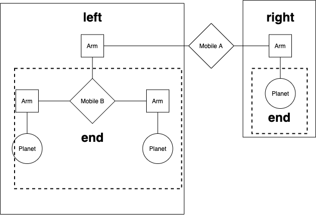
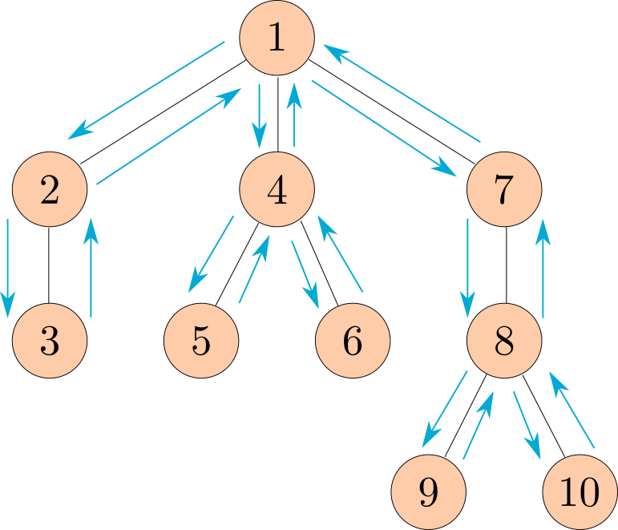

# Lab 04

## Problem 1: Mobiles

> *Acknowledgements*:
>
> This mobile example is based on a classic problem from Structure and Interpretation of Computer Programs, [Section 2.2.2](https://mitpress.mit.edu/sites/default/files/sicp/full-text/book/book-Z-H-15.html#%_sec_2.2.2).


We are making a planetarium mobile. A **mobile** is a type of hanging sculpture. A binary mobile consists of two arms. Each arm is a rod of a certain length, from which hangs either a planet or another mobile.



We will represent a binary mobile using the **data abstractions** below:

- A mobile has a left arm and a right arm.
- An arm has a positive length and something hanging at the end, either a mobile or planet.
- A planet has a positive size.

### Problem 1.1 Weights

Implement the planet data abstraction by completing the `planet` constructor and the `size` selector so that a planet is represented using a two-element list where the first element is the string 'planet' and the second element is its size. The `total_weight` example is provided to demonstrate use of the mobile, arm, and planet abstractions.

```python
# The constructor and selectors of the planet

def planet(size):
    """Construct a planet of some size.
    
    >>> planet(5)
    ['planet', 5]
    """
    assert size > 0
    "*** YOUR CODE HERE ***"

def size(w):
    """Select the size of a planet.
    
    >>> p = planet(5)
    >>> size(p)
    5
    """
    assert is_planet(w), 'must call size on a planet'
    "*** YOUR CODE HERE ***"

def is_planet(w):
    """Whether w is a planet."""
    return type(w) == list and len(w) == 2 and w[0] == 'planet'

# examples and usage

def examples():
    t = mobile(arm(1, planet(2)),
               arm(2, planet(1)))
    u = mobile(arm(5, planet(1)),
               arm(1, mobile(arm(2, planet(3)),
                              arm(3, planet(2)))))
    v = mobile(arm(4, t), arm(2, u))
    return (t, u, v)

def total_weight(m):
    """Return the total weight of m, a planet or mobile.

    >>> t, u, v = examples()
    >>> total_weight(t)
    3
    >>> total_weight(u)
    6
    >>> total_weight(v)
    9
    """
    if is_planet(m):
        return size(m)
    else:
        assert is_mobile(m), "must get total weight of a mobile or a planet"
        return total_weight(end(left(m))) + total_weight(end(right(m)))
```

> *Note*: the code listed above is the part you should fill in for the lab, see lab04.py for the complete codes.

### Problem 1.2: Balanced

> *Hint*: for more information on this problem (with more pictures!), please refer to [this document](https://inst.eecs.berkeley.edu/~cs61a/sp20/hw/hw04/assets/mobiles.pdf#page=3).

Implement the `balanced` function, which returns whether m is a balanced mobile. A mobile is balanced if two conditions are both met:

1. The torque applied by its left arm is equal to that applied by its right arm. Torque of the left arm is the length of the left rod multiplied by the total weight hanging from that rod. Likewise for the right.
2. Each of the mobiles hanging at the end of its arms is balanced.

Planets themselves are balanced.

```python
def balanced(m):
    """Return whether m is balanced.

    >>> t, u, v = examples()
    >>> balanced(t)
    True
    >>> balanced(v)
    True
    >>> w = mobile(arm(3, t), arm(2, u))
    >>> balanced(w)
    False
    >>> balanced(mobile(arm(1, v), arm(1, w)))
    False
    >>> balanced(mobile(arm(1, w), arm(1, v)))
    False
    """
    assert is_mobile(m)
    "*** YOUR CODE HERE ***"
```

### Problem 1.3: Mobile to Tree

Implement `totals_tree`, which takes a mobile (or planet) and returns a tree whose root is the total weight of the input. For a planet, the result should be a leaf. For a mobile, the result should be a tree and its branches should be the `totals_tree` for each ends of the arms.

```python
from ADT import tree, label, branches, is_leaf, print_tree

def totals_tree(m):
    """Return a tree representing the mobile/planet with its total weight at the root.

    >>> t, u, v = examples()
    >>> print_tree(totals_tree(t))
    3
      2
      1
    >>> print_tree(totals_tree(u))
    6
      1
      5
        3
        2
    >>> print_tree(totals_tree(v))
    9
      3
        2
        1
      6
        1
        5
          3
          2
    """
    assert is_mobile(m) or is_planet(m)
    "*** YOUR CODE HERE ***"
```

> *Hint*: you may want to use some helper functions imported from ADT.py.

## Problem 2: Preorder

Define the function `preorder`, which takes in a tree as an argument and returns a list of all the entries in the tree in the order that `print_tree` would print them.

The following diagram shows the order that the nodes would get printed, with the arrows representing function calls.



> *Note*: This ordering of the nodes in a tree is called a preorder traversal.

```python
def preorder(t):
    """Return a list of the entries in this tree in the order that they
    would be visited by a preorder traversal (see problem description).

    >>> numbers = tree(1, [tree(2), tree(3, [tree(4), tree(5)]), tree(6, [tree(7)])])
    >>> preorder(numbers)
    [1, 2, 3, 4, 5, 6, 7]
    >>> preorder(tree(2, [tree(4, [tree(6)])]))
    [2, 4, 6]
    """
    "*** YOUR CODE HERE ***"
```

## Problem 3: Trie

Write a function `has_path` that takes in a tree `t` and a string `word`. It returns `True` if there is a path starting from the root, along which the entries spell out the word. Otherwise, it returns `False`. (This data structure is called a trie, and it has a lot of cool applications!---think autocomplete). You may assume that every node's label is exactly one character.

```python
def has_path(t, word):
    """Return whether there is a path in a tree where the entries along the path
    spell out a particular word.

    >>> greetings = tree('h', [tree('i'),
    ...                        tree('e', [tree('l', [tree('l', [tree('o')])]),
    ...                                   tree('y')])])
    >>> print_tree(greetings)
    h
      i
      e
        l
          l
            o
        y
    >>> has_path(greetings, 'h')
    True
    >>> has_path(greetings, 'i')
    False
    >>> has_path(greetings, 'hi')
    True
    >>> has_path(greetings, 'hello')
    True
    >>> has_path(greetings, 'hey')
    True
    >>> has_path(greetings, 'bye')
    False
    """
    assert len(word) > 0, 'no path for empty word.'
    "*** YOUR CODE HERE ***"
```

## Problem 4: Insert

Write a function `insert_items` which takes as input a list `lst`, an argument `entry`, and another argument `elem`.

This function will check through each item present in `lst` to see if it is equivalent with `entry`. Upon finding an equivalent entry, the function should modify the list by placing `elem` into the list right after the found entry.

At the ending of the function, the modified list should be returned.

See the doctests for examples about the usage of this function. Use list mutation to modify the original list, no new lists should be created or returned.

**Be careful in situations where the values passed into entry and elem are equivalent, so as not to create an infinitely long list while iterating through it.** If you find that your code is taking more than a few seconds to run, it is most likely that the function is in a loop of inserting new values.

```python
def insert_items(lst, entry, elem):
    """
    >>> test_lst = [1, 5, 8, 5, 2, 3]
    >>> new_lst = insert_items(test_lst, 5, 7)
    >>> new_lst
    [1, 5, 7, 8, 5, 7, 2, 3]
    >>> large_lst = [1, 4, 8]
    >>> large_lst2 = insert_items(large_lst, 4, 4)
    >>> large_lst2
    [1, 4, 4, 8]
    >>> large_lst3 = insert_items(large_lst2, 4, 6)
    >>> large_lst3
    [1, 4, 6, 4, 6, 8]
    >>> large_lst3 is large_lst
    True
    """
    "*** YOUR CODE HERE ***"
```

> *Hint*: You may use the `lst.insert(ind, obj)` to insert an element obj to a position indexed by ind. Search the internet for more information about its usage. Here is just [a reference from Python Documentation](https://docs.python.org/3.9/tutorial/datastructures.html#more-on-lists).
